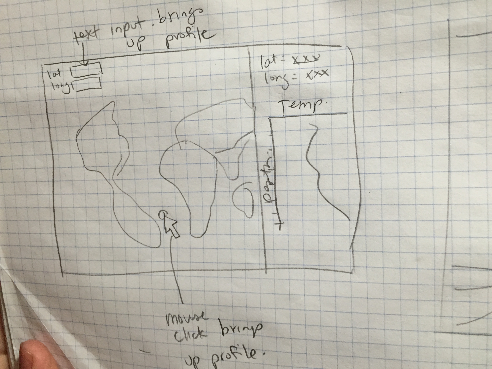

a3-HvanTol-MWeirath
===============

## Team Members

1. Michelle Weirathmueller (michw)
2. Helena van Tol (hmvantol)

## Interactive World Ocean Atlas

This is an example repository for your assignment 3 submission.
(Put your a brief description of your final interactive visualization application and your dataset here.)

## Running Instructions

Put your running instructions here. (Tell us how to run your visualization.)

If your visualization is web-based,  it would be great if your submission can be opened online. [Github Pages](http://pages.github.com/) is a good and easy way to put your visualization online so you can put your link here.  For example:

Access our visualization at http://cse512-16s.github.io/a3-jheer-mcorrell-jhoffs/ or download this repository and run `python -m SimpleHTTPServer 9000` and access this from http://localhost:9000/.

If you put your work online, please also write a [one-line description and add a link to your final work](http://note.io/1n3u46s) so people can access it directly from the CSE512-16S page.

## Story Board

### Data domain
Since we are both Oceanography graduate students, we decided to go with an ocean-related dataset: the [World Ocean Atlas 2013 (WOA 2013)](http://www.nodc.noaa.gov/OC5/woa13/woa13data.html). There are a number of simple variables that are often used by oceanographers to study the movements of different water masses. Some of those variables include temperature, salinity, and dissolved oxygen. The datasets provided through the WOA website are available as gridded files for each type of measurement. At each gridded location, the files contain a measurement "profile", which is a series of values interpolated to pre-defined depth bins. Oceanographers often look at measurements as a function of depth to understand the vertical stratification throughout the water column at a particular location. We will begin our visualization using one-degree gridded annual temperature, averaged between 2005-2012.

Oceanographers regularly explore large multi-variable data sets in 4D space (longitude, latitude, depth, time). Common visualization tools include maps, depth profiles, and T-S diagrams. On research cruises, oceanographers will interact with data as it is being collected to make decisions about where to sample along the cruise track and at which depths. Data exploration could be supported by linking multiple conmmonly used visualizations, allowing the user to observe multiple dimensions at once. Brushing could also be used to connect multiple variable or highlight particular regions of interest.

Here is our first idea:

### Changes between Storyboard and the Final Implementation

A paragraph explaining changes between the storyboard and the final implementation.

## Development Process

Include:
- Breakdown of how the work was split among the group members.
- A commentary on the development process, including answers to the following questions:
  - Roughly how much time did you spend developing your application?
  - What aspects took the most time?
